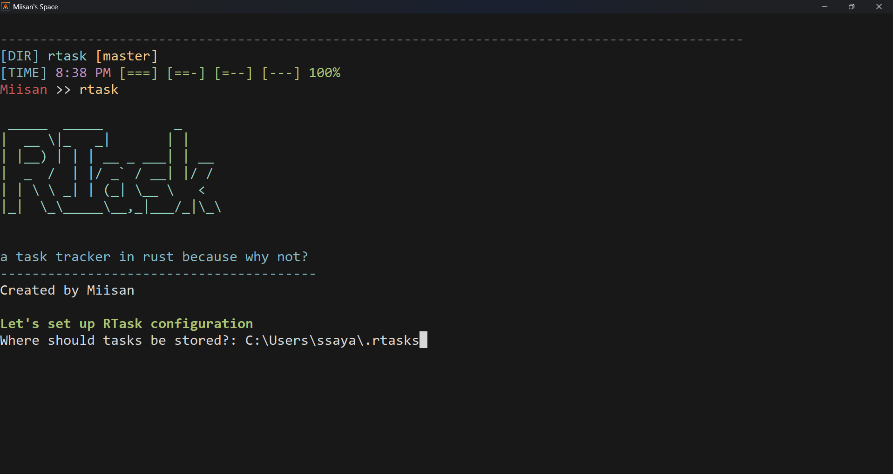
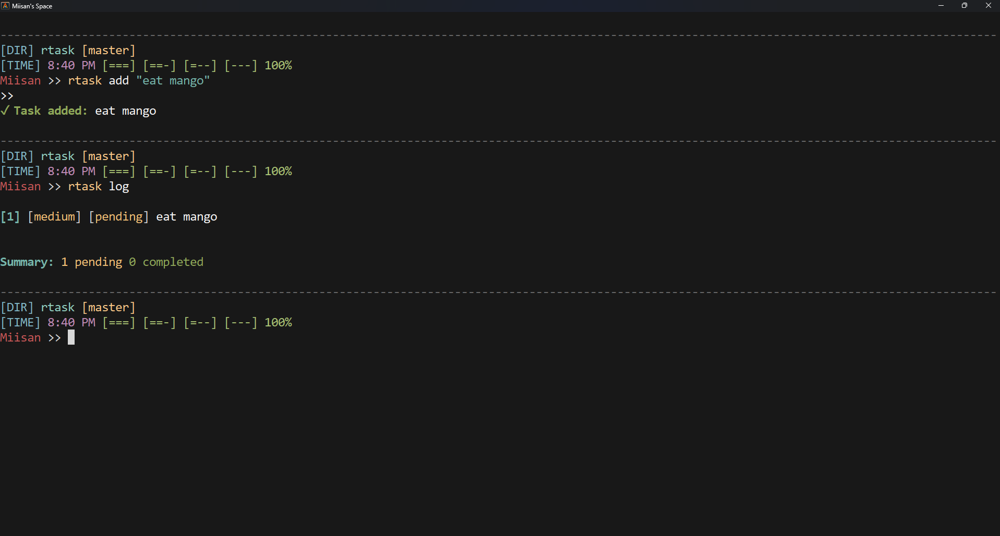

# RTask - CLI Task Tracker
A beautiful and simple CLI task tracker written in Rust.

## Features
- Simple and intuitive CLI interface
- Add, list, complete, and remove tasks
- Tag tasks for organization
- Set due dates for tasks
- Interactive mode for ease of use
- Beautiful terminal UI with colors
- Configurable task storage location

## seting it upp

### Using Cargo

if you have cargo (which i assume you do lol)
cargo install —git <[url](https://github.com/Miisan-png/rtask)
### From Source

1. Clone the repository:
```bash
git clone https://github.com/Miisan-png/rtask.git
cd rtask
```

2. Build the project:
```bash
cargo build --release
```

3. Install the binary:
```bash
cargo install --path .
```

## Usage

### First Run

When you first run `rtask`, you'll be prompted to configure the application:

```bash
rtask
```

### Commands
RTask supports both full commands and short aliases similar to Git:

#### Add a Task

```bash
# Add a new task
rtask add "start learning rust?" --priority high --due 2025-04-15 --tags "work,urgent"

# Short form 
rtask a "tell my bum assignment teammate to contribute" -p medium -d 2025-03-20 -t "personal,uni"
```

#### List Tasks

```bash
# List all pending tasks
rtask list
rtask ls
rtask log

# List all tasks including completed ones
rtask list --all
rtask ls -a

# List only completed tasks
rtask list --completed
rtask ls -c

# Filter tasks by tag
rtask list --filter work
rtask ls -f work
```

#### Complete Tasks

```bash
# Mark a task as complete by ID
rtask complete 1
rtask done 1
rtask c 1
```

#### Remove Tasks

```bash
# Remove a task by ID
rtask remove 2
rtask rm 2
rtask delete 2
```

#### View Task Details

```bash
# Show detailed information about a specific task
rtask show 1
rtask s 1
```

#### Show Today's Tasks

```bash
# Show tasks due today
rtask today
rtask td
```

#### Configuration

```bash
# Change RTask settings
rtask config
rtask cfg
```

### Interactive Mode

Launch the interactive mode by running `rtask` without any commands:

```bash
rtask
```

## Task Storage

By default, tasks are stored in your home directory:

- Windows: `C:\Users\halo\.rtasks\tasks.json`

You can change this location during configuration.

## Screenshots

<p align="center">

</p>

<p align="center">

</p>


## License
MIT License - see the [LICENSE](LICENSE) file for details.


## other stuff
- Inspired by CLI tools like Git and Todo.txt and warrorir 
- Built with Rust and various awesome crates
